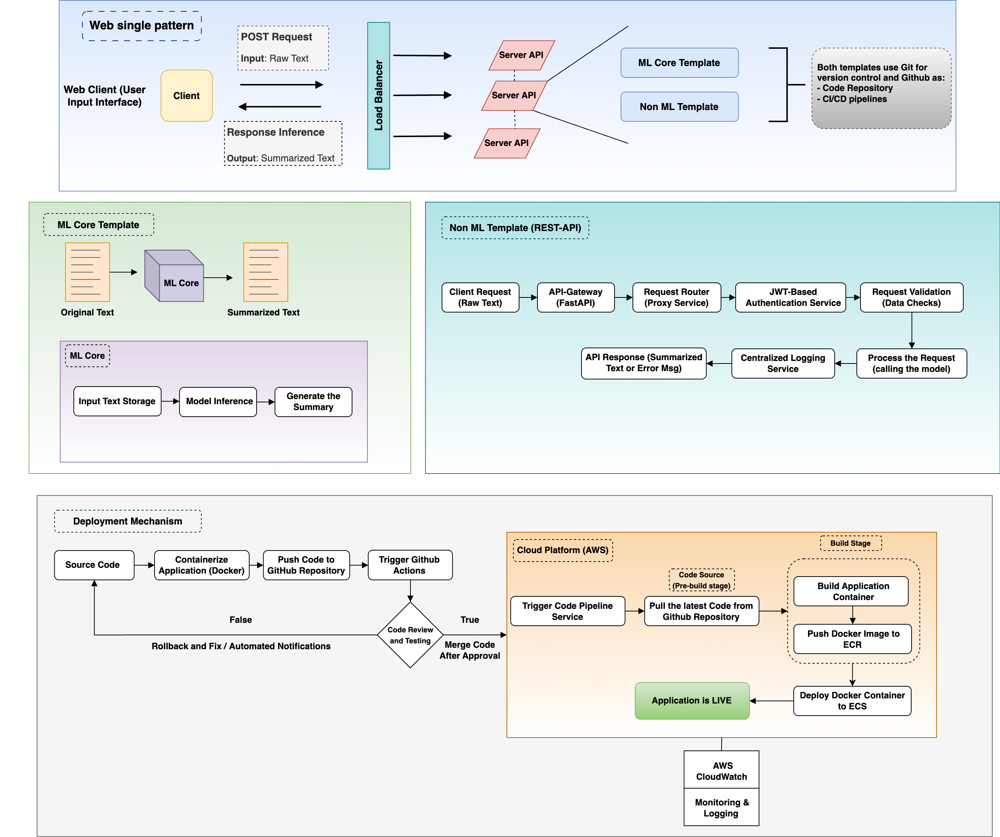

# Text Summarization System

This repository contains a **Text Summarization System** built using **FastAPI** for the backend and **Streamlit** for the frontend. The backend API performs user authentication and summarization of texts using a transformer model, while the frontend provides a user-friendly interface for inputting text and viewing summaries.

For more information on the product design and vision, you can refer to the [**Text Summarisation Product Design Template**](https://drive.google.com/file/d/142UIEqXk1khP-nDhZcywclJF7BA59FTF/view?usp=sharing).

## Table of Contents

- [Text Summarization System](#text-summarization-system)
  - [Table of Contents](#table-of-contents)
  - [System Design Overview](#system-design-overview)
    - [System Design Breakdown:](#system-design-breakdown)
  - [Project Structure](#project-structure)
    - [Purpose of Each Directory:](#purpose-of-each-directory)
  - [Features](#features)
  - [Requirements](#requirements)
  - [Installation](#installation)
  - [Running the Application](#running-the-application)
    - [Run the Application Locally](#run-the-application-locally)
      - [Important Note](#important-note)
  - [Testing the API](#testing-the-api)
  - [Contact](#contact)

## System Design Overview

Below is a high-level architecture diagram of the **Text Summarization System**. This diagram provides an overview of how the components are structured, including the **web client**, **API server**, **ML core template**, **REST API template**, and the **deployment pipeline** for hosting the application in a cloud environment.



### System Design Breakdown:

- **Web Client**: This is the user interface where raw text is inputted. The web client communicates with the server through a POST request to send text for summarization.
- **ML Core Template**: The ML core is responsible for processing the text, storing input, and generating the summarized output using a machine learning model.
- **Non-ML Template (REST API)**: This handles request routing, JWT-based authentication, request validation, and centralized logging for API requests.
- **Deployment Pipeline**: Describes the flow from source code to containerization, automated testing, and final deployment to AWS (ECS and ECR) with continuous monitoring through CloudWatch.

## Project Structure

### Purpose of Each Directory:

- **app/**: This directory contains the core FastAPI application, including route definitions, authentication logic, and overall app initialization. The `auth/` subdirectory includes functionality related to JWT authentication.

- **db/**: Responsible for database-related functionality, such as establishing connections with MongoDB. This directory ensures that the application can communicate with the database to store and retrieve user information.
- **logs/**: A directory reserved for logging application events or errors. It can be used to store logs for monitoring and debugging purposes (currently empty).
- **model/**: Contains the code related to the text summarization model. This directory is where the machine learning or transformer-based model logic resides, handling the processing and summarization of input text.
- **schemas/**: Houses the Pydantic models for request validation and data typing. This ensures that the inputs and outputs of the API are validated and structured correctly.
- **scripts/**: Includes various shell scripts to assist in project setup and management, such as setting up the environment (`install.sh`), starting the server (`server.sh`), and populating the database with dummy users (`setup.sh`).
- **ui/**: A directory intended for the frontend components, possibly built with Streamlit or any other frontend technology (currently empty in this structure).
- **utils/**: Contains utility functions that are shared across the application, such as password hashing. This directory centralizes reusable functionality.
- **.env**: A configuration file for environment variables like database URIs and secret keys.
- **buildspec.yml**: A build specification file typically used for CI/CD pipelines (such as AWS CodeBuild) to define build steps and deployment processes.
- **Dockerfile**: Instructions to containerize the application using Docker. This file defines the environment for running the app in a containerized format.
- **main.py**: The entry point to the FastAPI server, responsible for launching the application.
- **populate.py**: A script to populate the database with dummy data for testing and initial setup.
- **requirements.txt**: A list of the Python dependencies required to run the application.

## Features

- **User Authentication**: Users can register and login using JWT-based authentication.
- **Text Summarization**: Once authenticated, users can input large texts and receive summarized versions.
- **API Endpoints**: A RESTful API with endpoints for registration, login, and text summarization.
- **Frontend with Streamlit**: Provides a user interface where users can interact with the API to get summaries.

## Requirements

To run this project locally, you'll need the following installed on your machine:

- Python 3.10+
- MongoDB (for user data storage)
- Docker (optional, if you want to containerize the app)

## Installation

1. **Clone the Repository**:
   ```bash
   git clone https://github.com/asimzz/text-summarization-system.git
   cd text-summarization-system
   ```
2. **Create and Activate a Virtual Environment**:
   ```bash
   python -m venv venv
   source venv/bin/activate
   ```
3. **Install Dependencies**:
   ```bash
   pip install -r requirements.txt
   ```

## Running the Application

### Run the Application Locally

1. **Set Up Environment Variables**
   To run the application, you'll need to set up some environment variables. You can create a .env file in the root of your project with the following placeholders:

   ```bash
   # .env file

   MONGO_DB_URL=mongodb://your-mongo-url

   TOKEN_SECRET_KEY=your-secret-key

   ACCESS_TOKEN_EXPIRE_MINUTES=30

   # Base URL for the API service
   API_BASE_URL=http://127.0.0.1:8000
   ```

   **Note**: Make sure to replace the placeholders with your actual values. The `API_BASE_URL` should match the URL you use when running the API service. For local development, it should be set to http://127.0.0.1:8000.

   #### Important Note

   First of all, to run anything related to the API, navigate to the backend directory:

   ```bash
   cd backend
   ```

1. **Run the Setup Script**: Before starting the server, run the `setup.sh` script in the `scripts` folder to create dummy users in the database:
   ```bash
   sh scripts/setup.sh
   ```
1. **Start the FastAPI Server**: To run the API, execute the `server.sh` script in the `scripts` folder:

   ```bash
   sh scripts/server.sh
   ```

   The API should now be running at `http://127.0.0.1:8000`.

1. **Run the Streamlit App**: Navigate to the frontend directory and use the following command:
   ```bash
   cd frontend
   streamlit run app_ui.py
   ```
1. **Access the Application**: Open your web browser and go to `http://localhost:8501`

## Testing the API

Once the server is running, you can test the API by navigating to the built-in **FastAPI Swagger documentation** at:

```bash
http://localhost:8000/docs
```

This page provides a user-friendly interface to test all the API endpoints (such as login, registration, and text summarization) directly from your browser. You can input the required data and see the responses, which makes it easy to ensure the API is working as expected.

## Contact

If you have any comments, suggestions or anything you'd like to be clarify on, feel free
to reach us via email [Asim](mailto:amohamed@aimsammi.org), [Leema](mailto:lhamid@aimsammi.org), [Prince](mailto:pmensah@aimsammi.org) or let's connect on linkedin, [Asim](https://www.linkedin.com/in/asim-mohamed-9a2047135/), [Leema](https://www.linkedin.com/in/leema-hamid/), [Prince](https://www.linkedin.com/in/prince-mensah/).
